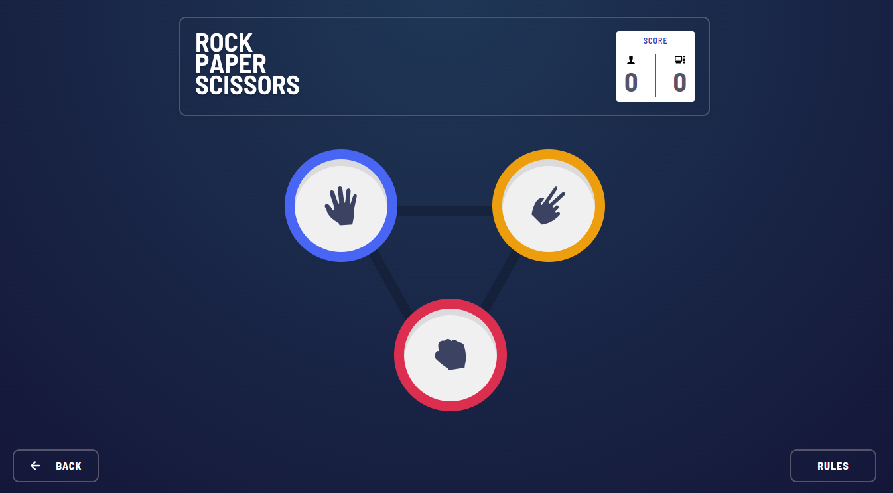
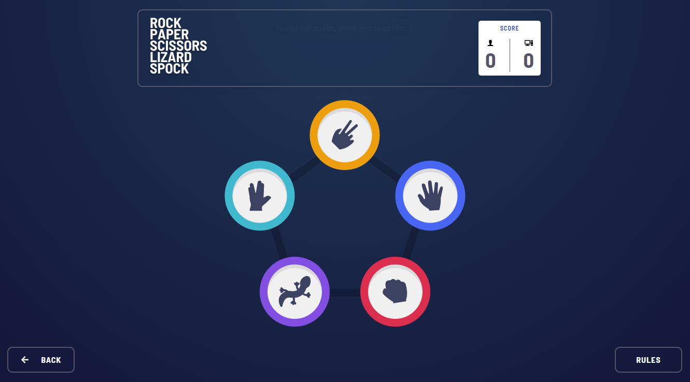

# 🪨📄✂️ Rock Paper Scissors Game (With Lizard & Spock Variant)

A fun and interactive Rock-Paper-Scissors game where the user can play against the computer in either Classic or Extended mode. Built using modern web development tools and fully responsive across all screen sizes.

<div>
  <a href="https://melodious-begonia-eb555e.netlify.app/" target="_blank">
    <strong>🌐 View Live Demo</strong>
  </a>
</div>

---

## 📷 Screenshots

| Game Selection Screen                                      | Classic Rock-Paper-Scissors                                  |
| ---------------------------------------------------------- | ------------------------------------------------------------ |
|  |  |

| Extended Mode (with Lizard & Spock)                              | Game Result                                          |
| ---------------------------------------------------------------- | ---------------------------------------------------- |
|  |  |

---

## ✨ Features

-   🎮 Choose between **two game modes**:
    -   **Classic Mode**: Rock, Paper, Scissors
    -   **Extended Mode**: Rock, Paper, Scissors, Lizard, Spock
-   👤 User selects an option; the **computer responds automatically**
-   🧠 **Win logic** based on each game's specific rules
-   📱 Fully **responsive design**, works on mobile, tablet, and desktop
-   🖼️ Clean UI built with **Flexbox & Grid** layouts

---

## 🛠 Tech Stack

-   ⚡ **Vite** – Fast development and build tool
-   ⚛️ **React** – UI built with functional components and hooks
-   🎨 **Sass (SCSS)** – Modular styling with reusable classes
-   📐 **CSS Flexbox & Grid** – To achieve clean, responsive layouts

---

## 🚀 Setup Instructions

Get the project running locally in just a few steps:

1. **Clone the repository**:
    ```bash
    git clone https://github.com/TornikeTt/Rock-Paper-Scissors-game.git
    ```
2. **Navigate to the project directory**:
    ```bash
    cd Rock-Paper-Scissors-game
    ```
3. **Install dependencies**:
    ```bash
    npm install
    ```
4. **Start the development server**:
    ```bash
    npm run dev
    ```

Open [http://localhost:5173](http://localhost:5173) (or the port shown in your terminal) in your browser to view and interact with the app.

---

Feel free to open an issue or create a pull request if you’d like to contribute. Happy coding! 🎉
